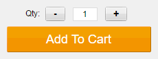

# ambimax® QtySwitcher

Qty Switcher for Magento 1 adds buttons to every qty input field for easier adjustments on tablets and smartphones



##  Installation

For installation use composer and modman or copy files manually.

### composer
```
"require": {
    "ambimax/magento-module-ambimax-qtyswitcher": "~1.0"
}
```

## Configuration

Configuration is found in tab ```System > Configuration > Catalog > ambimax® Qty Switcher```

## License

[MIT License](http://choosealicense.com/licenses/mit/)

## Author Information

 - [Tobias Schifftner](https://twitter.com/tschifftner), [ambimax® GmbH](https://www.ambimax.de)
